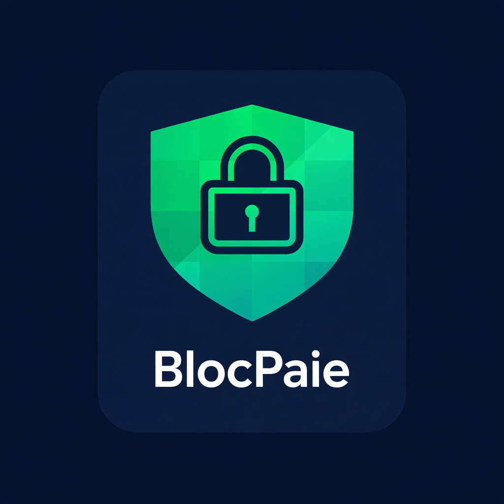

<div align="center">



# BlocPaie

**Confidential on-chain payroll for the modern workforce.**

Pay contractors on Ethereum while keeping every salary amount, payee identity, and payment status fully encrypted on-chain — powered by Zama's Fully Homomorphic Encryption and ERC-7984 confidential tokens.

[](https://sepolia.etherscan.io)
[](https://www.zama.ai)
[](https://porto.xyz)

</div>

---

## What is BlocPaie?

BlocPaie is an invoice-to-payment platform where companies create on-chain payroll vaults and pay contractors with sponsored, gasless transactions — no MetaMask, no gas fees, no exposed salaries.

- **Privacy by default** — salary amounts, payee addresses, and cheque statuses are stored as FHE ciphertexts. Nobody on-chain — including the contract itself — can read them in plaintext.
- **Passkey-native** — wallets are Porto smart accounts backed by WebAuthn passkeys. No seed phrases.
- **Gasless** — all transactions are sponsored via Ithaca Relay. Companies and contractors pay nothing in gas.
- **Two vault modes** — a transparent ERC-20 vault for compliance-first setups and a confidential vault for full privacy.

---

## How It Works

```
Company                                    Contractor
   │                                           │
   ├─ 1. Create vault (ERC-20 or Confidential) │
   ├─ 2. Deposit USDC / cUSDC                  │
   ├─ 3. Approve invoice                       │
   ├─ 4. Register cheque on-chain              │
   │      └─ Confidential: encrypted payee + amount
   │                                           │
   │                              ┌────────────┤
   │                              │ 5. Execute cheque
   │                              │    USDC / cUSDC transferred
   │                              │ 6. Decrypt cUSDC balance (optional)
   │                              │ 7. Unwrap cUSDC → USDC (optional)
   │                              └────────────┤
   ├─ 8. Withdraw remaining funds              │
```

### Privacy Model

| Data | ERC-20 Vault | Confidential Vault |
|------|--------------|--------------------|
| Salary amount | Public | Encrypted (FHE) |
| Payee address | Public | Encrypted (FHE) |
| Cheque status | Public | Encrypted (FHE) |
| cUSDC balance | — | Holder only (Zama `userDecrypt`) |

---

## Repositories

| Repo | Description |
|------|-------------|
| [**contracts**](https://github.com/BlocPaie/contracts) | Solidity smart contracts — ERC20Vault, ConfidentialVault, VaultFactory, cUSDC (ERC-7984). 88 tests. |
| [**backend**](https://github.com/BlocPaie/backend) | Express REST API — company/contractor identity registry, invoice lifecycle, vault transaction history. |
| [**frontend**](https://github.com/BlocPaie/frontend) | Next.js dApp — company and contractor dashboards, Porto passkey auth, client-side FHE operations. |

---

## Tech Stack

| Layer | Technology |
|-------|------------|
| Chain | Ethereum Sepolia |
| Smart contracts | Solidity 0.8.28, OpenZeppelin 5, Zama fhEVM |
| Confidential token | ERC-7984 — cUSDC wrapping USDC |
| Wallet & auth | Porto (EIP-7702 smart accounts, WebAuthn passkeys) |
| Gas sponsorship | Ithaca Relay + Porto merchant route |
| FHE | Zama `@zama-fhe/relayer-sdk` |
| Frontend | Next.js 16, React 19, Wagmi 3, viem 2 |
| Backend | Node.js, Express 4, MongoDB, Mongoose, Zod |

---

## Deployed Contracts (Ethereum Sepolia)

| Contract | Address |
|----------|---------|
| VaultFactory | [`0x619B322e1D722F86294B4d7dF92B42c89B3456aB`](https://sepolia.etherscan.io/address/0x619B322e1D722F86294B4d7dF92B42c89B3456aB) |
| MockUSDC | [`0xe89D1caF047aEc9F7f0F3623F799F3bc321fFc9c`](https://sepolia.etherscan.io/address/0xe89D1caF047aEc9F7f0F3623F799F3bc321fFc9c) |
| ConfidentialUSDC (cUSDC) | [`0x8a486Fa9c123ADc482d383f9fe8A48adaD7fBc17`](https://sepolia.etherscan.io/address/0x8a486Fa9c123ADc482d383f9fe8A48adaD7fBc17) |

---

## Future Improvements

### Infrastructure

| Item | What's missing today | What it would unlock |
|------|----------------------|----------------------|
| **Event Indexer** | The backend stores transactions only when the frontend explicitly POSTs after a confirmed tx. If the browser closes mid-flow or a tx lands without a frontend session, it's never recorded. | A background service listening to `ChequeRegistered`, `ChequeExecuted`, `FundsDeposited` etc. would keep the DB in sync regardless of client state — making the transaction history fully reliable and enabling real-time dashboard updates. |
| **Merchant route sponsorship filter** | `sponsor()` currently returns `true` for every incoming request — anyone who hits the endpoint can get arbitrary transactions sponsored. | Allowlist the vault factory + vault + cUSDC contract addresses so only BlocPaie contract calls are sponsored. Eliminates gas-drain abuse. |
| **Mainnet deployment** | Blocked on Zama fhEVM coprocessor mainnet availability. | Production-grade confidential payroll on Ethereum mainnet. |

### Privacy & Cryptography

| Item | Notes |
|------|-------|
| **ZK audit proofs** | Current audit model is hash-based (off-chain invoice data matched against on-chain `invoiceHash`). A future tier using Zama's verifiable FHE or a ZK proof would let auditors cryptographically verify that the encrypted on-chain values match the committed hash — without decrypting anything. |
| **ACL-based auditor access** | Vault owners could call `TFHE.allow(handle, auditorAddress)` to grant a specific auditor read access to individual cheque handles, enabling targeted compliance review without exposing the full payroll. |

### Product

| Item | Notes |
|------|-------|
| **Bulk payroll** | Register and execute multiple cheques in a single ERC-5792 `wallet_sendCalls` bundle. One passkey tap pays the entire team. |
| **Recurring invoices** | Auto-register a cheque every N days for a fixed retainer. Requires session keys (Porto `wallet_grantPermissions`) so the company doesn't tap every cycle. |
| **Session keys / automation** | All actions currently require a live passkey signature. Granting scoped session keys would allow scheduled payments and contractor self-service execution without a manual approval step each time. |
| **Contractor invite links** | Currently contractors register manually and share their ID out-of-band. A signed invite link would let companies onboard contractors in one click. |
| **Push notifications** | Notify contractors via email or push when an invoice is registered on-chain and ready to execute. |
| **Multi-token support** | USDC is the only supported token. EURC and DAI are in scope per spec — each requires a separate vault per token since the token is immutable at construction. |
| **Multi-chain** | Deploy to an L2 (Base, Arbitrum) once Zama coprocessor support is available there. Lower gas for ERC-20 vaults even today. |
| **Accounting integrations** | CSV export is the floor. Native QuickBooks / Xero sync via invoice metadata would close the loop for finance teams. |
| **Fiat on/offramp** | Currently crypto in, crypto out. The most impactful upgrade would be on the offramp side: when a contractor executes a cheque, the USDC settlement could be automatically converted and pushed to their bank account — no exchange account, no manual withdrawal. Integrating a provider like Stripe Treasury, Bridge, or MoonPay at the point of cheque execution would make BlocPaie a true end-to-end payroll system where the contractor simply taps "Execute" and the salary lands in their bank. On the deposit side, a fiat-to-USDC on-ramp would remove the crypto-native prerequisite for companies funding their vault. |

---
